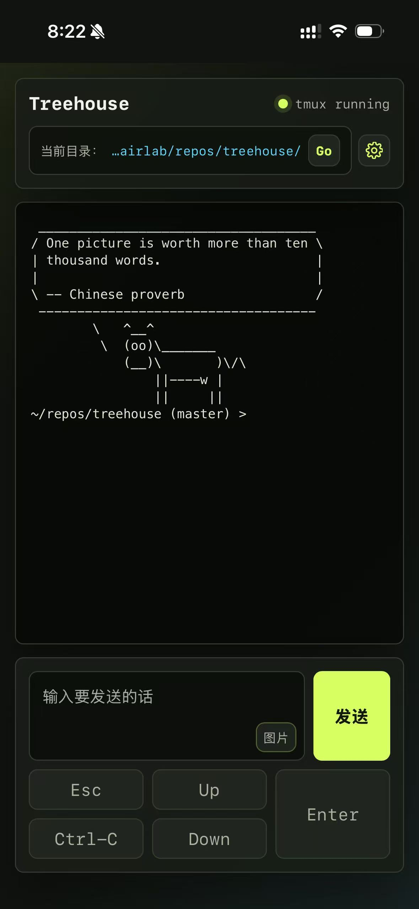

# Phone CLI Bridge

## 这个工具做什么用

Phone CLI Bridge 用手机浏览器远程控制 Mac 上的 tmux CLI 会话。

```text
iPhone Safari
  -> Phone CLI Bridge
  -> tmux session
  -> CLI command
  -> local project files
```

手机只是输入和显示界面，真正执行命令、读写文件、跑测试的还是 Mac。

它适合需要从手机查看或操作本机长时间运行的命令行任务，例如 AI coding CLI、shell、REPL、SSH 会话、构建脚本、测试脚本或其他交互式终端程序。

网页端示例：



## 如何安装

推荐用一行命令安装：

```bash
/bin/bash -c "$(curl -fsSL https://raw.githubusercontent.com/qteqpid/phone-cli-bridge/master/install.sh)"
```

安装脚本会检查安装 Homebrew、Node.js、tmux 和 git 并拉取项目代码，默认会安装到 `~/my_repos/phone-cli-bridge`，并根据当前 shell 写入 `phone-bridge` alias。

如果已经下载了源码，也可以在项目目录里运行：

```bash
./install.sh
```


## 如何使用

启动 bridge：

```bash
phone-bridge -r
```

启动后终端会打印手机可访问的 URL，类似：

```text
http://<LAN-IP>:8765?token=qteqpid
```

在手机浏览器打开这个 URL。不要用 `localhost`，手机上的 `localhost` 指的是手机自己。

建议把这个浏览器页面添加到手机主屏幕，之后可以像打开 App 一样快速进入。


常用启动参数：

```bash
phone-bridge -r -p 8766 -t qteqpid -n Treehouse -cmd "your-cli-command"
```

- `-p, --port`：指定端口，默认 `8765`；指定后端口被占用会直接退出
- `-t, --token`：指定访问 token；不指定时每次启动自动生成
- `-n, --title`：指定网页标题；不指定时默认 `Phone CLI`
- `-w, --workdir`：指定 CLI 工作目录；不指定时默认当前目录
- `-s, --session`：指定 tmux 会话名；不指定时默认 `phone-cli`
- `-cmd, --cmd`：指定 tmux 会话里要启动的命令；不指定时只创建会话，不自动运行命令

完整示例：

```bash
phone-bridge -r -w /path/to/project -s phone-cli -p 8765 -t qteqpid -n "Phone CLI" -cmd "your-cli-command"
```

停止 bridge：

```bash
phone-bridge -k
```


安全建议：

- 只在可信局域网或 Tailscale/WireGuard 里使用
- 不要把端口直接暴露到公网
- 固定 token 时不要把 URL 发给不可信的人
